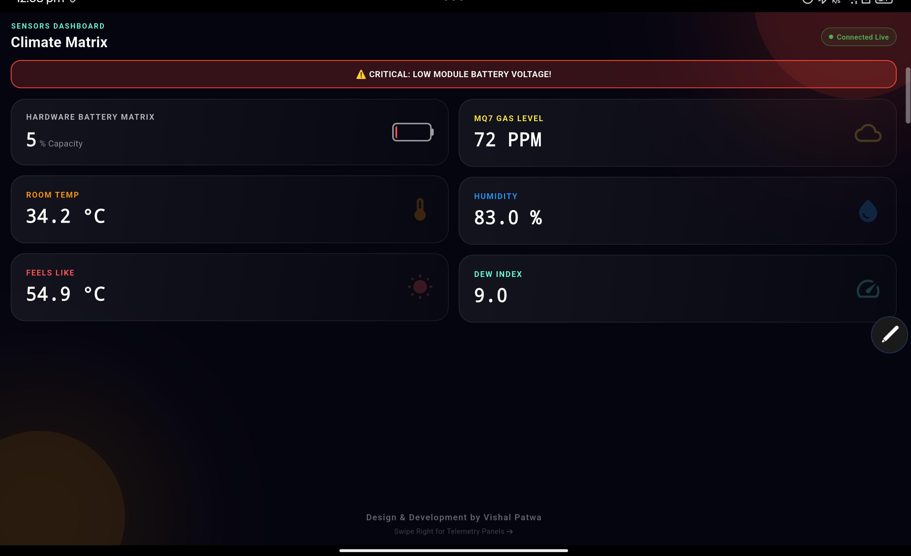
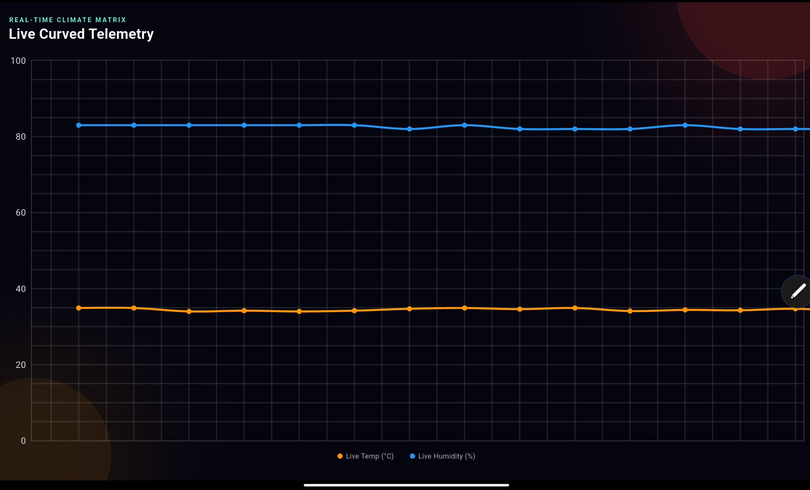
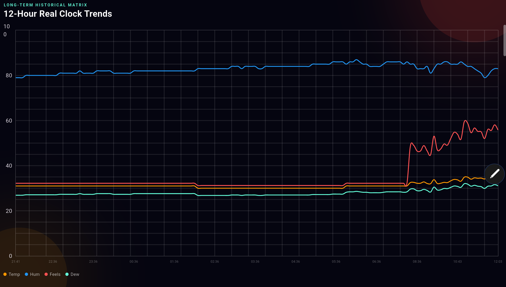
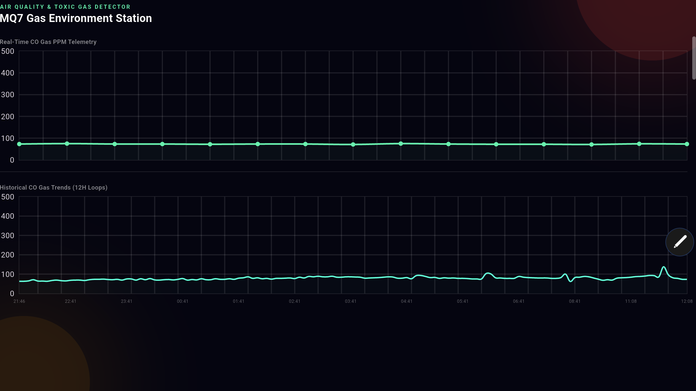

# 📊 Climate Matrix & Embedded Sensors Dashboard
An advanced, production-grade cross-platform Flutter application seamlessly integrated with an Arduino firmware architecture. This system tracks real-time environmental telemetry, structural metrics, and toxic carbon monoxide levels, presenting them through a modern glassmorphic UI layout.


## ⚠️ CRITICAL CONFIGURATION FOR NEW USERS 

Before compiling and installing this application on a new device or tablet, **you must change the Bluetooth MAC Address** inside the code to match your specific HC-05 module. If this is not updated, the application will fail to discover or establish a connection tunnel with the hardware.

### How to Update the MAC Address:
1. Open the Flutter project in VS Code.
2. Navigate to the core UI file: `lib/main.dart`.
3. Locate the variable definition named `hc05MacAddress` (around line 45-50):
   ```dart
   // Change this address to match your own HC-05 module's physical address
   final String hc05MacAddress = "17:3C:9A:1D:14:0E";

---

## ⚡ Embedded Hardware & Arduino Features

The firmware running on the microcontroller leverages robust embedded engineering practices to ensure data accuracy and hardware longevity:

* **Transistor-Controlled Sensor Warm-up (`BC547` Switching):** The MQ7 gas sensor is kept completely isolated at system startup via digital pin 7. It undergoes a strict 2-minute stabilization sequence to guarantee chemical reliability before registering data.
* **Buzzer Safety Lockout:** An integrated alarm buzzer logic features a 10-minute (600,000 ms) initial software delay. This prevents false-positive triggering during the initial chemical pre-heating spikes.
* **10-Readings Moving Average Filter:** To eliminate high-frequency ripple voltage and analog noise, the battery level data is smoothed using an optimized mathematical moving average loop.
* **RAM-Protected Micro-Storage Array:** Local microcontroller memory safely caches up to 144 points of historical curves (at 5-minute intervals). This data is written sequentially and can be completely recovered by the tablet app even after unexpected link breakages.

---

## 🚀 Flutter Application Features

* **Live Telemetry Streams:** High-performance curved line tracking for Room Temperature (°C) and Humidity (%) using real-time rendering.
* **Air Quality Station:** Dedicated telemetry panel for MQ7 Carbon Monoxide (CO) sensor monitoring with adaptive baseline matching.
* **Dynamic Battery Visual Matrix:** A custom battery structural canvas that dynamically translates voltages to standard indices:
    * 🔋 `> 60%` : Vibrant Green
    * ⚡ `30% - 60%` : Warning Orange
    * 🚨 `< 30%` : Critical Red with automated low-battery system flash alert banner.
* **4-Second Hardware Watchdog:** High-frequency link state protection that monitors data stream gaps and triggers immediate automatic channel re-routing if the connection goes silent for more than 4 seconds.

---

---

## 📸 App Screenshots Preview

Here is a visual matrix of the application interface running on the tablet dashboard:

| 📊 Main Dashboard View | 📈 Live Curved Telemetry |
| :---: | :---: |
|  |  |
| **Real-Time Climate Matrix & Battery** | **Dynamic Temp & Humidity Graphs** |

| 🕰️ 12-Hour Historical Trends | 🫁 MQ7 Air Quality Monitor |
| :---: | :---: |
|  |  |
| **Long-Term Micro-Storage Data** | **Dedicated Toxic Gas Monitoring** |

---

## 📸  Sensor and Battery connection diagram

  

---

---

## Components

1. Arduino Uno
2. MQ7 Gas Sensor
3. DHT11 Sensor
4. HC-05 / HC-06 Bluetooth
5. TP4056 Charging Module
6. 18650 Lithium-ion Battery(as per need) + battery holder
7. XL6009 Boost Converter
8. BC547 NPN Transistor
9. 5V Buzzer
10. 1k ohm Resistors (3)
11. Breadboard & Jumper Wires

---

## 📁 Repository Structure

```text
temperature_app/
├── arduino_code/
│   └── climate_monitor.ino      # Arduino firmware sketch, filtration & sampling
├── lib/
│   └── main.dart                # Flutter application core UI & state logic
├── pubspec.yaml                 # Dependency configuration matrix
└── README.md                    # Comprehensive repository documentation profile
